# Interaction of Continuous Effects, Layers 1-6

[March 25, 2019 | eloneth](https://blogs.magicjudges.org/searegion/author/eloneth/)

_Original Blogpost [here](https://blogs.magicjudges.org/searegion/2019/03/25/interaction-of-continuous-effects-layers-1-6/)_

_This article is a modified version of a presentation by [Sugeng Hartawan](https://apps.magicjudges.org/judges/dci/13344447) during the December 2017 SEA Region Judge Conference._

Grizzly Bears and Yargles aside, there are a lot of cards in Magic: the Gathering, each with their own unique effects. It’s part of the reason why this game is so fun and exciting, but sometimes you’d wonder if there’s an easier way to figure out what happens when someone tries to cast Invert on your Deep Freeze-d Ghalta with three +1/+1 counters on it. This article (and the next) will serve as a guide to the esoteric section of the Comprehensive Rules known as “Interaction of Continuous Effects”.

| 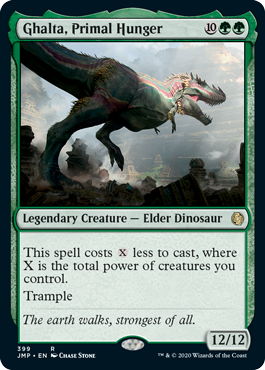 |  |

## What is a continuous effect?

- An effect that is generated by spell or ability of an object.
- Modifies characteristics/control of objects
- Some affect players or the rules of the game
- Some have a duration, some last until the game ends.

As you can see, there are a lot of effects in this game. Some of them are good for you, and some are bad.

What is an object then? These are considered objects under the rules of the game:

- An ability on the stack.
- A card, a copy of a card, or a token.
- A spell, a permanent, or an emblem.

How each continuous effect interacts with each other is divided into 7 layers, applied in this order: CCTPCAP

Layer 2. **(C)ontrol** effects
Layer 3. **(T)ext** effects
Layer 4. **(T)ype** effects
Layer 5. **(C)olor** effects
Layer 6. **(A)bility** adding/removing effects
Layer 7. **(P)ower** & Toughness
      7a. Characteristic Defining Ability (CDA)
      7b. Setting P/T
      7c. +/- P/T
      7d. Counter effect
      7e. Switching P/T

Now let’s go through the layers

### Layer 1 – Copy Effects

If an effect printed with a word **‘copy**’ in its ability text, then it is applied in this layer.

| 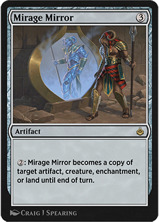 | 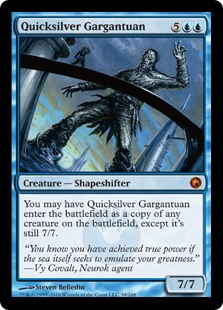 |

**Mirage Mirror**’s activated ability creates an effect that is also applied in layer 1.

If a copy effect does more things that just simply copying, all of it still applies in Layer 1. **Quicksilver Gargantuan**’s copy ability applies entirely in Layer 1, even the “set p/t to 7/7” part (which would usually apply in Layer 7b).

### Layer 2 — Control Effects

Anything related to control-changing a card is applied in this layer. The keyword is **‘control‘**.

| 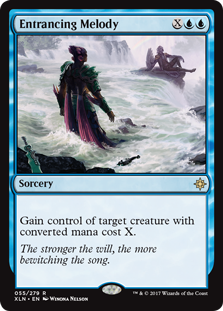 | 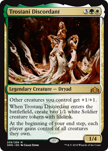 |

**Entrancing Melody**’s effect is a control effect, so it is applied in layer 2. Since it has no duration stated, it lasts until the game ends.

**Trostani Discordant**’s 3rd ability’s effect is also applied in layer 2.

### Layer 3 — Text-Changing Effects

Any effect that changes the text in a spell or permanent is applied in this layer.

Text changing effect can only change the type text, ability text in a card, with the exception of 2 cards (Spy Kit and Volrath’s Shapeshifter) that can change the name of the card. The keyword is **‘text’**.

| 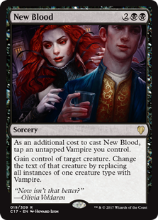 | 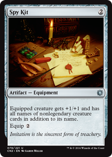 |

**New Blood** has 2 effects. One is changing control of the chosen creature which is applied in layer 2. The other one is changing all the text of that chosen creature type into a Vampire in layer 3.

**Spy Kit** has 2 effects, one is giving the creature extra names, that is applied in layer 3, and the other effect gives a creature +1/+1 which is applied in layer 7c.

### Layer 4 — Type-Changing Effects

Anything that changes, adds, or removes the type/subtype/supertype of a card is applied in this layer.

|  | 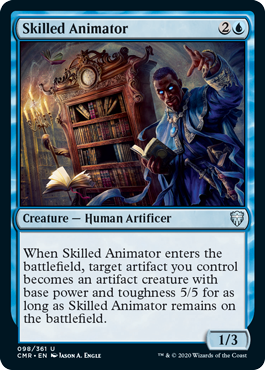 |

**Chameleon Colossus**’s original creature type (Shapeshifter) is overwritten by Changeling, so it is all creature types instead (Shapeshifter included).

**Skilled Animator**’s ability, the one that changes an artifact into an artifact creature, is also applied in layer 4 for as long as **Skilled Animator** stays in the battlefield.

| 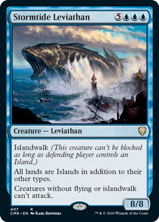 | 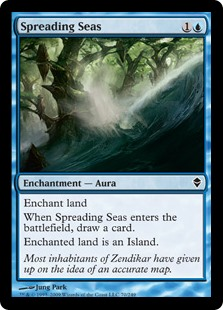 |

**Stormtide Leviathan** adding the Island subtype is applied in layer 4, without overwriting the land’s original subtypes.

**Spreading Seas** sets a land’s type into Island. If a land is set into a new basic land type, it loses all of its rule text, its old land types, and any copy effect that affecting it (CR 305.7).

### Color-Changing Effects

Any effect that changes/adds/removes the color of a card is applied in this layer. While “colorless” isn’t a color, this also includes turning a card colorless. Example: Devoid.

|  | 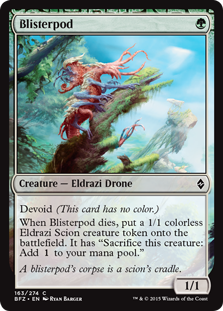 |

**Cloudchaser Kestrel** third ability’s effect is applied in layer 5.

**Blisterpod**’s devoid ability overwrites its default color (green, as seen in the symbols of its mana cost), making it colorless.

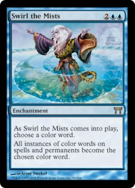

**Swirl the Mists**’s second ability is not a color-changing effect, but rather a text-changing effect, and thus will apply not in Layer 5, but Layer 3. Note that the ability mentions changing the text of cards, though you’ll have to check the Oracle text for that.

### Layer 6 – Ability adding/removing Effects

Any effect that gives a new ability or removes an ability is applied in this layer. Also, effects that make a creature lose its abilities is applied in this layer too.

The keywords are:

- Have/gain ‘Any ability keyword’
- Gain “…….”
- Lose “ability”

For example:

- Enchanted creature has hexproof.
- Target Creature gains trample.

| 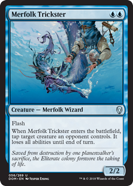 | 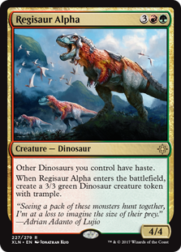 |

The effect of ‘loses all abilities’ from **Merfolk Trickster**’s 2nd ability is applied in layer 6.

**Regisaur Alpha**’s 1st ability is also applied in layer 6, while the second ability “with trample” is not applied in layer 6. If **Regisaur Alpha** loses all abilities or leaves the battlefield, the created Dinosaur token will still have trample.

### Layer 7 – Power/Toughness

Layer 7 has five sublayers, and deserves an article of its own.

## Timestamps

|  |  |

In general, these continuous effects are applied in the order listed above, first we figure out if there are any copy effects applied on a card, then control effects, and so on. Things get a little tricky when two effects happen in the same layer. For example, if **Mycosynth Lattice** is on the battlefield, what color would a creature enchanted by **Deep Freeze** be?

We know that color-changing effects apply in **Layer 5**. When two or more continuous effects clash in the same layer, we will apply the effects in the order they start affecting that object.

If **Deep Freeze** is already on the battlefield before **Mycosynth Lattice**, it means that Deep Freeze will say “This creature is blue”, then **Mycosynth Lattice** will say “No, this creature is colorless”, resulting in a colorless creature. The opposite is true if **Mycosynth Lattice** is on the battlefield before **Deep Freeze** – **Deep Freeze**’s (later) effect will make it a blue creature.

## Dependencies

A **dependency** between two continuous effects happens when one effect will cause another effect to no longer apply, or affects the set of objects the other effect applies.

For effects to qualify as ‘dependent’, both effects must

- apply in the same layer
- not be characteristic-defining abilities

Effect A is said to depend on effect B if applying B would cause:

- Effect A to no longer apply.
- a change on what effect A would apply to.
- a change on how effect A applies to the things it applies to.

When effect A is dependent on effect B, we apply effect B first then effect A.

| 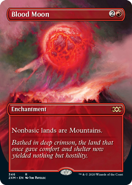 | 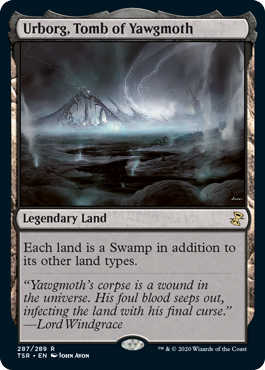 |

One of the most popular cases for dependency is **Blood Moon** and **Urborg, Tomb of Yawgmoth**. What will happen if both of them are in play? How does this affect other nonbasic lands?

The effects of these two cards form a dependency because:

    Both **Urborg, Tomb of Yawgmoth** and **Blood Moon**’s effects apply in Layer 4.
    **Urborg, Tomb of Yawgmoth** will be affected by **Blood Moon**’s ability.
    If you apply **Blood Moon**’s effect first, then **Urborg, Tomb of Yawgmoth** will lose its ability.

So we say that **Urborg, Tomb of Yawgmoth**’s effect is dependent on **Blood Moon**’s.

Because of this, we always apply **Blood Moon** first regardless of which enters the battlefield first. And as a result, **Urborg, Tomb of Yawgmoth** will always be a Mountain that can tap for red mana and no other abilities.

Layer 7 will be in another article. I hope you have enjoyed Part 1.
