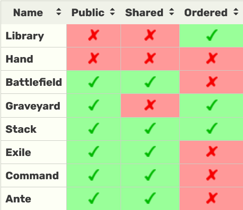

# Zones

There are normally seven zones: library, hand, battlefield, graveyard, stack, exile, and command. Some older cards also use the ante zone.

_For the purposes of **truename** we will only bother with the first six._

## Properties

Different zones have different rules associated with them, and can be classified using three properties:

 - In a public zone, cards are visible to all players by default. Cards in a hidden zone are usually face down.
 - If a zone is shared, that means each game only has one of that zone. Other zones exist in multiples, one for each player.
 - Some zones track the order of objects in them, while others do not.

 